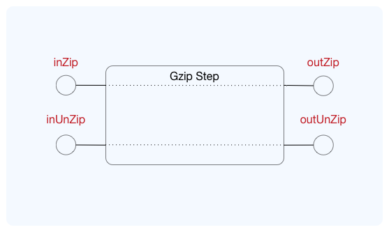

== Step gzip
This step is for zipping and and unzipping streams. It uses the 'node zlib' for this.

=== Configuration
The configuration for this step is only the step name.

.Message formats
[source,js]
----
{
  "name" : stepName,           <1>
}
----
<1> (Mandatory) The name of this step. This name will be used the reference this step in a 'flow'.

=== Endpoints
This step has two ''in'' endpoints and two ''out'' endpoints.

.Step schematic

==== inZip
This endpoint is used to zip a stream. The result will be available at ''outZip''.

.Endpoint description
[options="header", cols="2"]
|====
|Description|Value
|*Name*|inZip
|*Direction*|in
|*Active*|false
|*Passive*|true
|====

.Message formats
[source,js]
----
{
  "payload": stream          <1>
}
----
<1> A readable byte stream which should be zipped.

==== inUnZip
This endpoint is used to un-zip a stream. The result will be available at ''outUnZip''.

.Endpoint description
[options="header", cols="2"]
|====
|Description|Value
|*Name*|inUnZip
|*Direction*|in
|*Active*|false
|*Passive*|true
|====

.Message formats
[source,js]
----
{
  "payload": stream          <1>
}
----
<1> A readable zipped byte stream which should be un-zipped.

==== outZip
This endpoint emits messages with the zipped stream comming from the ''inZip'' endpoint.

.Endpoint description
[options="header", cols="2"]
|====
|Description|Value
|*Name*|outZip
|*Direction*|out
|*Active*|true
|*Passive*|false
|====

.Message Format
[source,js]
----
{
  "payload": stream          <1>
}
----
<1> The zipped byte stream

==== outUnZip
This endpoint emits messages with the un-zipped stream comming from the ''inUnZip'' endpoint.

.Endpoint description
[options="header", cols="2"]
|====
|Description|Value
|*Name*|outUnZip
|*Direction*|out
|*Active*|true
|*Passive*|false
|====

.Message Format
[source,js]
----
{
  "payload": stream          <1>
}
----
<1> The un-zipped byte stream
